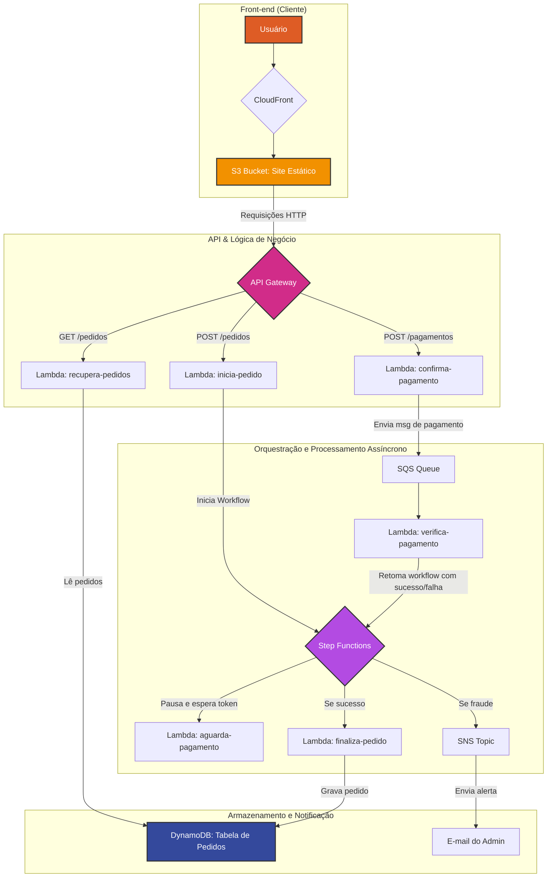

# Projeto E-commerce 100% Serverless na AWS


*(Substitua o link acima pelo GIF animado que você criou a partir do vídeo)*

## 📌 Visão Geral

Este repositório contém o código-fonte e um guia de implementação detalhado para a criação de um projeto de e-commerce totalmente serverless na nuvem da AWS. O projeto simula um fluxo completo e desacoplado de um pedido online, desde a seleção de produtos no front-end até o processamento do pagamento e o registro da compra no back-end.

Este guia foi elaborado para servir como um tutorial, permitindo que outros estudantes e entusiastas de cloud possam replicar o laboratório e aprender na prática a integrar os principais serviços serverless da AWS.

- **Aluno:** Artur Costa ([@arturcosta86](https://github.com/arturcosta86))
- **Instrutor:** Tomas Alric ([@TomasAlric](https://github.com/TomasAlric))

---

## 🛠️ Tecnologias Utilizadas

- **Computação:** AWS Lambda
- **API:** Amazon API Gateway
- **Orquestração:** AWS Step Functions
- **Banco de Dados:** Amazon DynamoDB
- **Mensageria:** Amazon SQS & Amazon SNS
- **Armazenamento e CDN:** Amazon S3 & Amazon CloudFront
- **Segurança:** AWS IAM

---

## 📁 Estrutura do Repositório

O projeto está organizado em duas pastas principais, refletindo a separação entre o front-end e o back-end.

```
.
├── 📂 back-end-ecommerce-main/
│   ├── 📂 edn-ecommerce-aguarda-pagamento/
│   ├── 📂 edn-ecommerce-confirma-pagamento/
│   ├── ... (e outras pastas de Lambdas)
│   └── 📂 edn-ecommerce-workflow-step-functions/
│
├── 📂 front-end-ecommerce-main/
│   ├── 📂 assets/
│   ├── 📂 css/
│   ├── 📂 js/
│   ├── 📂 pages/
│   └── index.html
│
└── 📂 evidencias/
    └── (Suas imagens de evidência)
```

---

## 🚀 Guia de Implementação (Passo a Passo)

Para replicar este projeto em sua própria conta AWS, siga os passos detalhados abaixo.

### **Parte 1: Configuração do Back-end**

#### **1.1. IAM Role: O Passaporte de Permissões**
O primeiro passo é criar um "passaporte" (IAM Role) que dará permissão para nossas funções Lambda interagirem com outros serviços da AWS.

1.  No console do IAM, vá em **Roles** e clique em **Create role**.
2.  Selecione **AWS service** e, em "Use case", escolha **Lambda**.
3.  Anexe as seguintes políticas gerenciadas pela AWS. Elas dão as permissões necessárias para o projeto:
    - `AWSLambdaBasicExecutionRole` (para logs no CloudWatch)
    - `AmazonDynamoDBFullAccess`
    - `AmazonSQSFullAccess`
    - `AmazonSNSFullAccess`
    - `AWSStepFunctionsFullAccess`
4.  Dê um nome para a role (ex: `ecommerce-lambda-role`) e finalize a criação.

*Evidência da Role Criada:*


#### **1.2. Recursos de Dados e Mensageria**
Agora, vamos criar os serviços que irão armazenar dados e gerenciar mensagens.

- **DynamoDB:**
  1. No console do DynamoDB, clique em **Create table**.
  2. Dê um nome para a tabela (ex: `pedidos-ecommerce`).
  3. Defina a **Partition key** como `pedidoId` (do tipo String).
  4. Mantenha as configurações padrão e crie a tabela.

*Evidência da Tabela DynamoDB:*


- **SQS (Simple Queue Service):**
  1. No console do SQS, clique em **Create queue**.
  2. Selecione o tipo **Standard**.
  3. Dê um nome para a fila (ex: `fila-pagamentos`) e crie a fila.

- **SNS (Simple Notification Service):**
  1. No console do SNS, clique em **Topics** e depois em **Create topic**.
  2. Selecione o tipo **Standard**.
  3. Dê um nome para o tópico (ex: `notificacoes-fraude`).
  4. Após criar o tópico, vá para a aba **Subscriptions** e crie uma nova inscrição, selecionando **Email** como protocolo e inserindo seu endereço de e-mail. Você precisará confirmar a inscrição no seu e-mail.

#### **1.3. Funções Lambda: O Cérebro da Operação**
Crie as 6 funções Lambda (Runtime: Python 3.9+). Para cada uma:
1.  Vá em **Create function**, escolha "Author from scratch".
2.  Dê o nome da função (ex: `inicia-pedido`).
3.  Em "Permissions", escolha **Use an existing role** e selecione a IAM Role que você criou no passo 1.1.
4.  Após criar, cole o código correspondente da pasta `back-end-ecommerce-main`.
5.  Configure as **variáveis de ambiente** necessárias na aba "Configuration" -> "Environment variables" (ex: `DYNAMODB_TABLE`, `SQS_URL`).
6.  Clique em **Deploy** para salvar cada função.

*Evidência de uma Lambda Configurada:*


#### **1.4. Step Functions: O Maestro da Orquestra**
1.  No console do Step Functions, clique em **Create state machine**.
2.  Escolha "Design your workflow visually" ou "Write your workflow in code".
3.  Cole o código ASL do arquivo `edn-ecommerce-workflow-step-functions/workflow.asl.json`.
4.  **Ponto Crítico:** Percorra o código e substitua todos os placeholders (`<REGIAO>`, `<ID_CONTA>`, etc.) pelos **ARNs corretos** dos seus recursos (Lambdas, Tópico SNS).
5.  Associe a IAM Role criada anteriormente à sua máquina de estado.
6.  Dê um nome e crie a máquina de estado.

*Evidência do Workflow:*


#### **1.5. API Gateway: A Porta de Entrada**
1.  No console do API Gateway, clique em **Build** em "REST API".
2.  Escolha "New API" e dê um nome (ex: `api-ecommerce`).
3.  Crie os recursos `/pedidos` e `/pagamentos` a partir da raiz (`/`).
4.  Para cada recurso, crie os métodos HTTP (`GET`, `POST`) conforme o laboratório.
5.  **Integração:** Para cada método, configure a "Integration type" como **Lambda Function**.
    - **Ponto Crítico 1:** Marque a caixa de seleção **"Use Lambda Proxy integration"**. Isso é essencial para que o CORS e as respostas da Lambda funcionem corretamente.
    - Selecione a função Lambda correspondente.
6.  **CORS:** Para cada recurso (`/pedidos` e `/pagamentos`), clique em "Actions" -> **"Enable CORS"**. Confirme as configurações padrão.
7.  **Deploy:** Finalmente, clique em "Actions" -> **"Deploy API"**. Crie um novo estágio chamado `dev` e faça o deploy. Copie a **Invoke URL** gerada.

*Evidência da Configuração do API Gateway:*


### **Parte 2: Configuração do Front-end**

#### **2.1. S3 e CloudFront: A Vitrine da Loja**
1.  **Bucket S3:** Crie um bucket S3. Na aba "Properties", habilite o **"Static website hosting"**. Na aba "Permissions", edite a "Block public access" para desmarcar o bloqueio e adicione uma "Bucket policy" para permitir acesso público de leitura.
2.  **CloudFront:** Crie uma nova distribuição do CloudFront. Em "Origin domain", selecione seu bucket S3. Mantenha as outras configurações padrão.

#### **2.2. Deploy e Configuração Final**
1.  **Upload dos Arquivos:** Faça o upload de todo o conteúdo da pasta `front-end-ecommerce-main` para o seu bucket S3.
    - **Ponto Crítico:** Ao fazer o upload (ou editando os metadados depois), garanta que o `Content-Type` dos arquivos `.js` seja `application/javascript` e dos arquivos `.css` seja `text/css`.
2.  **Configuração da API_URL:**
    - Abra os arquivos `.js` que contêm a variável `API_URL` (`revisar-pedido.js`, `pagamento.js`, `meus-pedidos.js`).
    - Substitua a URL de exemplo pela **Invoke URL** que você copiou do API Gateway.
3.  **Upload Final e Invalidação:**
    - Faça o upload novamente dos arquivos `.js` atualizados.
    - No console do CloudFront, vá para sua distribuição, na aba **"Invalidations"**, e crie uma nova invalidação com o caminho `/*`. Aguarde a conclusão.

*Evidência do Site Funcionando:*


---

## 🏛️ Arquitetura da Aplicação

O diagrama abaixo ilustra o fluxo de dados e a interação entre os serviços AWS utilizados neste projeto.

